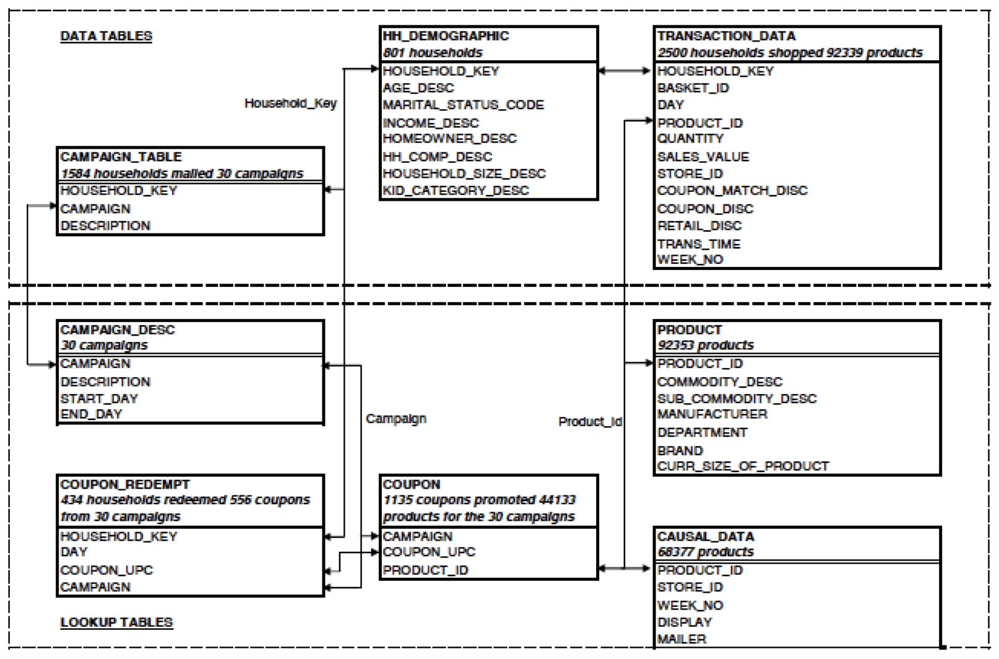

```{r setup, include = FALSE}
knitr::opts_chunk$set(
  collapse = TRUE,
  comment = "##",
  message = FALSE,
  warning = FALSE,
  eval = FALSE
)
```

## The Complete Journey

**completejourney** provides access to data sets characterizing household level 
transactions over one year from a group of 2,469 households who are frequent 
shoppers at a grocery store. It contains all of each household’s purchases, not 
just those from a limited number of categories. For certain households, demographic 
information as well as direct marketing contact history are captured. 

Due to the number of tables and the overall complexity of The Complete Journey, 
it is suggested that this database be used in more advanced classroom settings. 
Further, The Complete Journey would be ideal for academic research as it should 
enable one to study the effects of direct marketing to customers.

The following are examples of questions that could be submitted to students or 
considered for academic research:

* How many customers are spending more over time? Less over time? Describe these customers.
* Of those customers who are spending more over time, which categories are growing at a faster rate?
* Of those customers who are spending less over time, with which categories are they becoming less engaged?
* Which demographic factors (e.g. household size, presence of children, income) 
appear to affect customer spend? Engagement with certain categories?
* Is there evidence to suggest that direct marketing improves overall engagement?

## Accessing the Data

```{r load-pkg}
library(completejourney)
```

```{r load-pkg-hidden, echo=FALSE}
#devtools::load_all(path = "/Users/b294776/Desktop/Workspace/Packages/completejourney")
```


There are eight built-in data sets available in this package (see `data(package = 'completejourney')`. 
The data sets include:

* `campaigns`: campaigns received by each household
* `campaign_descriptions`: campaign metadata (length of time active)
* `coupons`: coupon metadata (UPC code, campaign, etc.)
* `coupon_redemptions`: coupon redemptions (household, day, UPC code, campaign)
* `demographics`: household demographic data (age, income, family size, etc.)
* `products`: product metadata (brand, description, etc.)
* `promotions_sample`: a sampling of the product placement in mailers and in stores corresponding to advertising campaigns
* `transactions_sample`: a sampling of the products purchased by households

Due to the size of the transactions and promotions data, the package provides a
sampling of the data built-in with `transactions_sample` and `promotions_sample`. 
However, you can access the full promotions and transactions data sets from the 
source GitHub repository with the following: 

```{r load-transactions}
# get the full transactions data set
transactions <- get_transactions()
transactions
## # A tibble: 1,469,307 x 11
##    household_id store_id basket_id product_id quantity sales_value retail_disc
##    <chr>        <chr>    <chr>     <chr>         <dbl>       <dbl>       <dbl>
##  1 900          330      31198570… 1095275           1        0.5        0    
##  2 900          330      31198570… 9878513           1        0.99       0.1  
##  3 1228         406      31198655… 1041453           1        1.43       0.15 
##  4 906          319      31198705… 1020156           1        1.5        0.290
##  5 906          319      31198705… 1053875           2        2.78       0.8  
##  6 906          319      31198705… 1060312           1        5.49       0.5  
##  7 906          319      31198705… 1075313           1        1.5        0.290
##  8 1058         381      31198676… 985893            1        1.88       0.21 
##  9 1058         381      31198676… 988791            1        1.5        1.29 
## 10 1058         381      31198676… 9297106           1        2.69       0    
## # … with 1,469,297 more rows, and 4 more variables: coupon_disc <dbl>,
## #   coupon_match_disc <dbl>, week <int>, transaction_timestamp <dttm>
```

```{r load-promotions}
# get the full promotions data set
promotions <- get_promotions()
promotions
## # A tibble: 20,940,529 x 5
##    product_id store_id display_location mailer_location  week
##    <chr>      <chr>    <fct>            <fct>           <int>
##  1 1000050    316      9                0                   1
##  2 1000050    337      3                0                   1
##  3 1000050    441      5                0                   1
##  4 1000092    292      0                A                   1
##  5 1000092    293      0                A                   1
##  6 1000092    295      0                A                   1
##  7 1000092    298      0                A                   1
##  8 1000092    299      0                A                   1
##  9 1000092    304      0                A                   1
## 10 1000092    306      0                A                   1
## # … with 20,940,519 more rows
```

```{r load-both}
# a convenience function to get both
c(promotions, transactions) %<-% get_data(which = 'both', verbose = FALSE)
dim(promotions)
## [1] 20940529        5

dim(transactions)
## [1] 1469307      11
```


## Dataset Details

```{r data-relationships, echo=FALSE, out.height="95%", out.width="95%", eval=TRUE}

```

### `demographics`

This table contains demographic information for a portion of households. Due to 
nature of the data, the demographic information is not available for all households.

Variable | Description
------------- | --------------------------------------------
`household_id` | Uniquely identifies each household
`age` | Estimated age range
`income` | Household income
`home_ownership` | Homeowner, renter, etc.
`marital_status` | Marital status (Married, Single, Unknown)
`household_size` | Size of household up to 5+
`household_comp` | Household composition
`kid_count` | Number of children present up to 3+

### `transactions`

Contains transaction-level product purchases by households (what you would normally 
see on a receipt). Use a sample of all transactions (`transactions_sample`) or get
the entire data set with `get_transactions()`.

Variable | Definition
------------- | --------------------------------------------
`household_id` | Uniquely identifies each household
`store_id` | Uniquely identifies each store
`basket_id` | Uniquely identifies each purchase occasion
`product_id` | Uniquely identifies each product
`quantity` | Number of the product purchased during the trip
`sales_value` | Amount of dollars the retailer receives from sale
`retail_disc` | Discount applied due to the retailer's loyalty card program
`coupon_disc` | Discount applied due to a manufacturer coupon
`coupon_match_disc` | Discount applied due to retailer's match of manufacturer coupon 
`week` | Week of the transaction; Ranges 1-53
`transaction_timestamp` | Date and time of day when the transaction occurred

The variable `sales_value` in this table is the amount of dollars received by the 
retailer on the sale of the specific product, taking the coupon match and loyalty 
card discount into account. It is not the actual price paid by the customer. If a 
customer uses a coupon, the actual price paid will be less than the `sales_value` 
because the manufacturer issuing the coupon will reimburse the retailer for the 
amount of the coupon.

To calculate the actual product prices, use the formulas below:

 * Loyalty card price = (sales_value – (retail_disc + coupon_match_disc)) / quantity
 * Non-loyalty card price = (sales_value – (coupon_match_disc)) / quantity

The example below demonstrates how to calculate the actual shelf price of the product:

```{r example-transaction-data, echo=FALSE}
library(dplyr)
library(lubridate)

l1 <- transactions %>% 
  filter(basket_id == "35730137393", 
         product_id == "819063") 
l2 <- transactions %>% 
  filter(basket_id == "31672240446", 
         product_id == "819063")
l3 <- transactions %>% 
  filter(basket_id == "36027750817", 
         product_id == "819063")

bind_rows(l1, l2, l3) %>% 
  select(product_id, quantity, sales_value, retail_disc, coupon_disc, coupon_match_disc)
## # A tibble: 3 x 6
##   product_id quantity sales_value retail_disc coupon_disc coupon_match_disc
##   <chr>         <dbl>       <dbl>       <dbl>       <dbl>             <dbl>
## 1 819063            1        1.67        0           0                 0   
## 2 819063            2        3.34        0.36        0                 0   
## 3 819063            2        2.89        0           0.55              0.45
```

* Line 1 – When this product was purchased the `retail_disc` and `coupon_disc` were 
both zero, meaning the price of the product is the same as the amount received by the retailer.
* Line 2 – Two items of this product were purchased, and there was a retail discount 
applied due to a loyalty card. To determine the regular shelf price of the product 
(exclusive of loyalty card discount) we take the sum of the amount paid and the 
discount, then divide it by the quantity ($\$3.34 + \$0.36) \div 2 = \$1.85$. The 
shelf price of the product including loyalty card discount is $\$3.34 \div 2 = \$1.67$. 
In this case, the customer paid $3.34 for both of these products, which is the same amount 
the retailer received.
* Line 3 – The actual shelf price of each product here is ($\$2.89 + \$0.45) \div 2 = \$1.67$. 
In this case, the customer paid \$2.34 ($\$2.89 - \$0.55$) for these products, but 
the retailer will receive $2.89 due to reimbursement of the manufacturer discount.

### `campaigns` 

Contains identifying information for the marketing campaigns each households participated in.

Variable | Definition
------------- | --------------------------------------------
`campaign_id` | Uniquely identifies each campaign; Ranges 1-27
`household_id` | Uniquely identifies each household

### `campaign_descriptions`

Contains campaign metatdata, specifically the time a campaign 
was active.

Variable | Definition
------------- | --------------------------------------------
`campaign_id` | Uniquely identifies each campaign; Ranges 1-27
`campaign_type` | Type of campaign (Type A, Type B, Type C)
`start_date` | Start date of campaign
`end_date` | End date of campaign

### `products`

Contains metatdata regarding the products purchased (brand, description, etc.).

Variable | Definition
------------- | --------------------------------------------
`product_id` | Uniquely identifies each product
`manufacturer_id` | Uniquely identifies each manufacturer
`department` | Groups similar products together
`brand` | Indicates private or national label brand
`product_category` | Groups similar products together at lower level
`product_type` | Groups similar products together at lowest level
`package_size` | Indicates package size (not available for all products)

### `coupons`

This table lists all the coupons sent to customers as part of a campaign, as well 
as the products for which each coupon is redeemable. Some coupons are redeemable 
for multiple products. One example is a coupon for any private label frozen vegetable. 
There are a large number of products where this coupon could be redeemed.

For campaign TypeA, this table provides the pool of possible coupons. Each customer 
participating in a Type A campaign received 16 coupons out of the pool. The 16 coupons 
were selected based on the customer’s prior purchase behavior. Identifying the 
specific 16 coupons that each customer received is outside the scope of this database.

For campaign Type B and Type C, all customers participating in a campaign receives 
all coupons pertaining to that campaign.

Variable | Definition
------------- | --------------------------------------------
`coupon_upc` | Uniquely identifies each coupon (unique to household and campaign)
`product_id` | Uniquely identifies each product
`campaign_id` | Uniquely identifies each campaign

### `coupon_redemptions`

Contains individual coupon redemptions (household, day, UPC 
code, campaign) that can be used to measure campaign efficacy and coupon usage 
on specific products.

Variable | Definition
------------- | --------------------------------------------
`household_id` | Uniquely identifies each household
`coupon_upc` | Uniquely identifies each coupon (unique to household and campaign)
`campaign_id` | Uniquely identifies each campaign
`redemption_date` | Date when the coupon was redeemed 

### `promotions`

Contains product placement information (e.g. mailer page placement 
and in-store display placement) corresponding to campaigns.  Use a sample of all 
promotions (`promotions_sample`) or get the entire data set with `get_promotions()`.

Variable | Definition
------------- | --------------------------------------------
`product_id` | Uniquely identifies each product
`store_id` | Uniquely identifies each store
`display_location` | Display location (0-no display, 1-store front, 2-store rear, 3-front end cap, 4-mid-aisle end cap, 5-rear end cap, 6-side aisle end cap, 7-in-aisle, 9-secondary location display, A-in-shelf)
`mailer_location` | Mailer location (0-not on ad, A-interior page feature, C-interior page line item, D-front page feature, F-back page feature, H-wrap front feature, J-wrap interior coupon, L-wrap back feature, P-interior page coupon, X-free on interior page, Z-free on front page, back page, or wrap)
`week` | Week of the transaction; Ranges 1-53

## Example Case Study

John Smith is a valued customer at a national grocery retailer for which we have 
detailed transaction data. Throughout all the tables in the database, he is 
identified with a `household_id` of "208".

To learn a little about John, we can obtain his demographic information by looking 
at the record in the `demographics` table where `household_id = "208"`. The table 
below shows the information we receive, and tells us that he is a homeowner, 
who makes between \$50,000 and \$74,000 a year and is between 45 and 54 years old.

```{r}
demographics %>% 
  filter(household_id == "208")
## # A tibble: 1 x 8
##   household_id age   income home_ownership marital_status household_size household_comp
##   <chr>        <ord> <ord>  <ord>          <ord>          <ord>          <ord>         
## 1 208          45-54 50-74K Homeowner      NA             2              2 Adults No K…
## # … with 1 more variable: kids_count <ord>
```

If we look at John’s records from `campaigns`, we can see that he received 7 
different campaigns.

```{r}
campaigns %>% 
  filter(household_id == "208")
## # A tibble: 7 x 2
##   campaign_id household_id
##   <chr>       <chr>       
## 1 13          208         
## 2 17          208         
## 3 18          208         
## 4 22          208         
## 5 26          208         
## 6 27          208         
## 7 8           208
```

These campaigns were spread out over the one year period of the study. To understand 
the time periods and types of these campaigns, you can join with the `campaign_descriptions` 
data. In this example, we see the type of campaign along with the start and end 
dates of the campaign.

```{r}
campaigns %>% 
  filter(household_id == "208") %>% 
  left_join(., campaign_descriptions, by="campaign_id") %>% 
  arrange(start_date)
## # A tibble: 7 x 5
##   campaign_id household_id campaign_type start_date end_date  
##   <chr>       <chr>        <ord>         <date>     <date>    
## 1 26          208          Type B        2016-12-28 2017-02-19
## 2 27          208          Type A        2017-02-08 2017-03-26
## 3 8           208          Type A        2017-05-08 2017-06-25
## 4 13          208          Type A        2017-08-08 2017-09-24
## 5 17          208          Type B        2017-10-18 2017-11-19
## 6 18          208          Type A        2017-10-30 2017-12-24
## 7 22          208          Type B        2017-12-06 2018-01-07
```

Let us take a closer look at campaign 18 When we look at all the distinct 
coupon_upc’s from the coupon table where `campaign_id = "18"`, we see that there were 
209 distinct coupons sent out as part of that campaign.

```{r}
coupons %>% 
  filter(campaign_id == "18") %>%
  distinct(coupon_upc)
## # A tibble: 209 x 1
##    coupon_upc 
##    <chr>      
##  1 10000085475
##  2 10000085476
##  3 10000085477
##  4 10000085478
##  5 10000085479
##  6 10000085480
##  7 10000085484
##  8 10000089237
##  9 10000089238
## 10 10000089239
## # … with 199 more rows
```

Let us take an even deeper look at one of the specific coupons offered as part of 
the campaign. If we print out all records from the coupon table where `campaign_id = "18"`
and `coupon_upc = "55410000076"`, we see that this coupon could actually be redeemed 
for a number of products.

```{r}
coupons %>% 
  filter(campaign_id == "18", 
         coupon_upc == "55410000076")
## # A tibble: 50 x 3
##    coupon_upc  product_id campaign_id
##    <chr>       <chr>      <chr>      
##  1 55410000076 1004458    18         
##  2 55410000076 1011841    18         
##  3 55410000076 1016495    18         
##  4 55410000076 10182852   18         
##  5 55410000076 1018696    18         
##  6 55410000076 1058591    18         
##  7 55410000076 1065032    18         
##  8 55410000076 1069973    18         
##  9 55410000076 107157     18         
## 10 55410000076 1110721    18         
## # … with 40 more rows
```

Although all the products are not displayed above, we find that this coupon is actually 
valid on 50 distinct products. If we go to the product table and print out all records 
for the `product_id`’s above ("1004458", "1011841", etc.), we see that this coupon is valid 
for pickles from a national brand.

```{r}
coupons %>% 
  filter(campaign_id == "18", 
         coupon_upc == "55410000076") %>% 
  left_join(., products, by="product_id") %>%
  select(product_id, manufacturer_id, department, brand, 
         product_category, product_type, package_size)
## # A tibble: 50 x 7
##    product_id manufacturer_id department brand product_category product_type
##    <chr>      <chr>           <chr>      <fct> <chr>            <chr>       
##  1 1004458    1318            GROCERY    Nati… PICKLE/RELISH/P… PICKLES     
##  2 1011841    1318            GROCERY    Nati… PICKLE/RELISH/P… PICKLES     
##  3 1016495    1318            GROCERY    Nati… PICKLE/RELISH/P… PICKLD VEG …
##  4 10182852   1318            GROCERY    Nati… PICKLE/RELISH/P… PICKLES     
##  5 1018696    1318            GROCERY    Nati… PICKLE/RELISH/P… PICKLES     
##  6 1058591    1318            GROCERY    Nati… PICKLE/RELISH/P… PICKLES     
##  7 1065032    1318            GROCERY    Nati… PICKLE/RELISH/P… PICKLES     
##  8 1069973    1318            GROCERY    Nati… PICKLE/RELISH/P… PICKLES     
##  9 107157     1318            GROCERY    Nati… PICKLE/RELISH/P… PICKLES     
## 10 1110721    1318            GROCERY    Nati… PICKLE/RELISH/P… PICKLES     
## # … with 40 more rows, and 1 more variable: package_size <chr>
```

As we’ve seen, John received a number of campaigns over the past year that contained 
many coupons. Chances are, he did not redeem every coupon he received. So, let us 
take a look to see what coupons he did redeem. To do this, we need to view all records 
from the `coupon_redemptions` table where `household_id = "208"`. This shows us that 
he redeemed five coupons from two of the campaigns ("8" and "18").

```{r}
coupon_redemptions %>%
  filter(household_id == "208")
## # A tibble: 5 x 4
##   household_id coupon_upc  campaign_id redemption_date
##   <chr>        <chr>       <chr>       <date>         
## 1 208          55100090033 8           2017-05-23     
## 2 208          51800015050 18          2017-11-09     
## 3 208          51920021576 18          2017-11-09     
## 4 208          55410000076 18          2017-11-13     
## 5 208          10000085475 18          2017-11-18 
```

John’s coupon redemptions are only part of the overall picture of his purchasing 
behavior. If we look at the records from the transaction_data table where 
`household_id = "208"`, we can view everything that John purchased.

```{r}
transactions %>%
  filter(household_id == "208")
## # A tibble: 756 x 11
##    household_id store_id basket_id product_id quantity sales_value retail_disc
##    <chr>        <chr>    <chr>     <chr>         <dbl>       <dbl>       <dbl>
##  1 208          327      31268866… 845379            1        7.64        0   
##  2 208          327      31268866… 854133            1        4.69        0.5 
##  3 208          327      31268866… 862349            1        1           0.99
##  4 208          327      31268866… 879504            1        2           1.19
##  5 208          327      31268866… 990519            1        1.69        0   
##  6 208          327      31268866… 1068830           1        1.09        0   
##  7 208          327      31268866… 1097635           1        2.96        0   
##  8 208          324      31344175… 883932            1        2           0.59
##  9 208          324      31344175… 885290            1        1.99        0   
## 10 208          324      31344175… 915502            2        4           2.78
## # … with 746 more rows, and 4 more variables: coupon_disc <dbl>,
## #   coupon_match_disc <dbl>, week <int>, transaction_timestamp <dttm>
```

This gets a bit complicated, but we can combine the transaction data with the other 
tables to understand John’s behavior when he was redeeming a coupon (and when he 
wasn’t redeeming a coupon).  

 - John received offers as part of campaign 18, which occurred between 10/30/2017 and 12/24/2017
 - We know he redeemed `coupon_upc = "55410000076"` on day 11/13/2017
 - Through the coupon table, we know that the coupon is actually valid for a number 
 of products, including `product_id = "896292"`
 - From the table below, we can see where John purchased this item and received a 
 \$1 discount from using the coupon.

```{r}
transactions %>%
  filter(household_id == "208", 
         product_id == "896292",
         as_date(transaction_timestamp) == "2017-11-13")
## # A tibble: 1 x 11
##   household_id store_id basket_id product_id quantity sales_value retail_disc
##   <chr>        <chr>    <chr>     <chr>         <dbl>       <dbl>       <dbl>
## 1 208          327      40715247… 896292            2           4        2.58
## # … with 4 more variables: coupon_disc <dbl>, coupon_match_disc <dbl>, week <int>,
## #   transaction_timestamp <dttm>
```

Knowing when John redeemed a coupon can help us learn a lot about him, and how the 
receipt of certain campaigns affected his behavior. Does the receipt of campaigns 
cause him to purchase more items than he did previously? Is John more likely to 
redeem coupons for products he already purchases, or does it entice him to try 
products he has never purchased before?

There is one bit of information we have not talked about yet – what is happening 
in the rest of the store? Is it possible that John purchased the item above because 
of other events occurring in the store in addition to his coupon?

We obviously do not know a customer’s reason for purchasing an item, but we do 
know whether an item was featured during the time of the purchase. If we view all 
records from the `promotions` table where `product_id = "896292"`, we see the 
weeks and stores where this product was featured in the weekly mailer and whether 
it was featured as part of an in-store display. If we look at the first line, 
we can tell that in store 327 and week 47, the product was on the shelf (i.e. 
`display_location="A"`) so it was not part of a special display. We can assume 
this was not an impulse buy because of a display or advertisement. He most likely 
went to the store with the coupon intent upon purchasing the item.

```{r}
promotions %>%
  filter(product_id == "896292", 
         store_id == "327")
## # A tibble: 2 x 5
##   product_id store_id display_location mailer_location  week
##   <chr>      <chr>    <fct>            <fct>           <int>
## 1 896292     327      A                0                  47
## 2 896292     327      A                0                  49
```

We hope that this quick look at John Smith’s behavior provides clarity around The 
Complete Journey database, and inspires your own investigation into the purchasing 
behavior of these customers.
