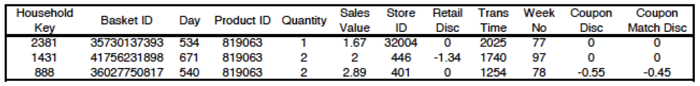

```{r setup, include = FALSE}
knitr::opts_chunk$set(
  collapse = TRUE,
  comment = "#>",
  message = FALSE,
  warning = FALSE
)
```

## The Complete Journey

This dataset contains household level transactions over two years from a group of 2,500 households who are frequent shoppers at a retailer. It contains all of each household’s purchases, not just those from a limited number of categories. For certain households, demographic information as well as direct marketing contact history are included.

Due to the number of tables and the overall complexity of The Complete Journey, it is suggested that this database be used in more advanced classroom settings. Further, The Complete Journey would be ideal for academic research as it should enable one to study the effects of direct marketing to customers.

The following are examples of questions that could be submitted to students or considered for academic research:

* How many customers are spending more over time? Less over time? Describe these customers.
* Of those customers who are spending more over time, which categories are growing at a faster rate?
* Of those customers who are spending less over time, with which categories are they becoming less engaged?
* Which demographic factors (e.g. household size, presence of children, income) appear to affect customer spend? Engagement with certain categories?
* Is there evidence to suggest that direct marketing improves overall engagement?

## Dataset Details

```{r data-relationships, echo=FALSE, out.height="95%", out.width="95%"}
knitr::include_graphics("data_relationships.png")
```

### `demographics`

This table contains demographic information for a portion of households. Due to nature of the data, the demographic information is not available for all households.

Variable | Description
------------- | --------------------------------------------
`household_id` | Uniquely identifies each household
`age_desc` | Estimated age range
`marital_status_code` | Marital status (A - married, B - single, U - unknown)
`income_desc` | Household income
`homeowner_desc` | Homeowner, renter, etc.
`hh_comp_desc` | Household composition
`household_size_desc` | Size of household up to 5+
`kid_category_desc` | Number of children present up to 3+

### `transactions`

Contains transaction-level product purchases by households (what you would normally see on a receipt).  

Variable | Definition
------------- | --------------------------------------------
`household_id` | Uniquely identifies each household
`store_id` | Uniquely identifies each store
`basket_id` | Uniquely identifies each purchase occasion
`product_id` | Uniquely identifies each product
`quantity` | Number of the product purchased during the trip
`sales_value` | Amount of dollars the retailer receives from sale
`retail_disc` | Discount applied due to the retailer's loyalty card program
`coupon_disc` | Discount applied due to a manufacturer coupon
`coupon_match_disc` | Discount applied due to retailer's match of manufacturer coupon 
`week_no` | Week of the transaction; Ranges 1-102
`day` | Day when the transaction occurred
`trans_time` | Time of day when the transaction occurred

The variable `sales_value` in this table is the amount of dollars received by the retailer on the sale of the specific product, taking the coupon match and loyalty card discount into account. It is not the actual price paid by the customer. If a customer uses a coupon, the actual price paid will be less than the `sales_value` because the manufacturer issuing the coupon will reimburse the retailer for the amount of the coupon.

To calculate the actual product prices, use the formulas below:
 * Loyalty card price = (sales_value – (retail_disc + coupon_match_disc)) / quantity
 * Non-loyalty card price = (sales_value – (coupon_match_disc)) / quantity

The example below demonstrates how to calculate the actual shelf price of the product:

```{r example-transaction-data, echo=FALSE, out.height="95%", out.width="95%"}

```

* Line 1 – When this product was purchased the `retail_disc` and `coupon_disc` were both
zero, meaning the price of the product is the same as the amount received by the
retailer.
* Line 2 – Two items of this product were purchased, and there was a retail discount
applied due to a loyalty card. To determine the regular shelf price of the product (exclusive of loyalty card discount) we take the sum of the amount paid and the discount, then divide it by the quantity. ($\$2 + \$1.34) \div 2 = \$1.67$. The shelf price of the product including loyalty card discount is $\$2 \div 2 = \$1$. Also, the customer paid $2 for both of these products which is the same amount the retailer received.
* Line 3 – The actual shelf price of each product here is ($\$2.89 + \$0.45) \div 2 = \$1.67$. Also, the customer paid \$2.34 ($\$2.89 - \$0.55$) for these products, but the retailer will receive $2.89 due to the manufacturer discount.

### `campaigns` 

Contains identifying information for the marketing campaigns each households participated in.

Variable | Definition
------------- | --------------------------------------------
`household_id` | Uniquely identifies each household
`campaign` | Uniquely identifies each campaign; Ranges 1-30
`description` | Type of campaign (TypeA, TypeB, TypeC)

### `campaign_descriptions`

Contains campaign metatdata, specifically the time a campaign 
was active.

Variable | Definition
------------- | --------------------------------------------
`campaign` | Uniquely identifies each campaign; Ranges 1-30
`description` | Type of campaign (TypeA, TypeB, TypeC)
`start_day` | Start date of campaign
`end_day` | End date of campaign

### `products`

Contains metatdata regarding the products purchased (brand, description, etc.).

Variable | Definition
------------- | --------------------------------------------
`product_id` | Uniquely identifies each product
`manufacturer` | Uniquely identifies each manufacturer
`department` | Groups similar products together
`brand` | Indicates private or national label brand
`commodity_desc` | Groups similar products together at lower level
`sub_commodity_desc` | Groups similar products together at lowest level
`curr_size_of_product` | Indicates package size (not available for all products)

### `coupons`

This table lists all the coupons sent to customers as part of a campaign, as well as the products for which each coupon is redeemable. Some coupons are redeemable for multiple products. One example is a coupon for any private label frozen vegetable. There are a large number of products where this coupon could be redeemed.

For campaign TypeA, this table provides the pool of possible coupons. Each customer participating in a TypeA campaign received 16 coupons out of the pool. The 16 coupons were selected based on the customer’s prior purchase behavior. Identifying the specific 16 coupons that each customer received is outside the scope of this database.

For campaign TypeB and TypeC, all customers participating in a campaign receives all coupons pertaining to that campaign.

Variable | Definition
------------- | --------------------------------------------
`coupon_upc` | Uniquely identifies each coupon (unique to household and campaign)
`product_id` | Uniquely identifies each product
`campaign` | Uniquely identifies each campaign

### `coupon_redemptions`

Contains individual coupon redemptions (household, day, UPC 
code, campaign) that can be used to measure campaign efficacy and coupon usage 
on specific products.

Variable | Definition
------------- | --------------------------------------------
`household_id` | Uniquely identifies each household
`coupon_upc` | Uniquely identifies each coupon (unique to household and campaign)
`campaign` | Uniquely identifies each campaign
`day` | Day when transaction occurred

### `product_placements`

Contains product placement information (e.g. mailer page placement 
and in-store display placement) corresponding to campaigns.

Variable | Definition
------------- | --------------------------------------------
`product_id` | Uniquely identifies each product
`store_id` | Uniquely identifies each store
`week_no` | Week of the transaction; Ranges 1-102
`display` | Display location (0-display, 1-store front, 2-store rear, 3-front end cap, 4-mid-aisle end cap, 5-rear end cap, 6-side aisle end cap, 7-in-aisle, 9-secondary location display, A-in-shelf)
`mailer` | Mailer location (0-not on ad, A-interior page feature, C-interior page line item, D-front page feature, F-back page feature, H-wrap front feature, J-wrap interior coupon, L-wrap back feature, P-interior page coupon, X-free on interior page, Z-free on front page, back page, or wrap)


## Example Case Study

John Smith is a valued customer at a national grocery retailer for which we have detailed transaction data. Throughout all the tables in the database, he is identified with a `household_id` of 208.

To learn a little about John, we can obtain his demographic information by looking at the record in the `demographics` table where `household_id = 208`. The table below shows the information we receive, and tells us that he is a homeowner, who makes between \$50,000 and \$74,000 a year and is between 45 and 54 years old.

```{r}
library(completejourney)
library(dplyr)
library(bit64)

demographics %>% filter(household_id == 208)
```

If we look at John’s records from `campaigns`, we can see that he received 8 different campaigns. Five of the campaigns were TypeA, and three were TypeB.

```{r}
campaigns %>% filter(household_id == 208)
```

These campaigns were spread out over the 2 year period of the study. To understand the time periods of these campaigns, look at the records in the `campaigns` table for the campaigns listed above for John.

```{r}
johns_campaigns <- campaigns %>% 
  filter(household_id == 208) %>% 
  distinct(description) %>%
  pull()

campaign_descriptions %>% filter(description %in% johns_campaigns)
```

Let us take a closer look at campaign 22. When we look at all the distinct coupon_upc’s from the coupon table where campaign = 22, we see that there were 21 distinct coupons sent out as part of that campaign.

```{r}
coupons %>% 
  filter(campaign == 22) %>%
  distinct(coupon_upc)
```

Let us take an even deeper look at one of the specific coupons offered as part of the campaign. If we print out all records from the coupon table where campaign = 22 and coupon_upc = 51800000050, we see that this coupon could actually be redeemed for a number of products.


